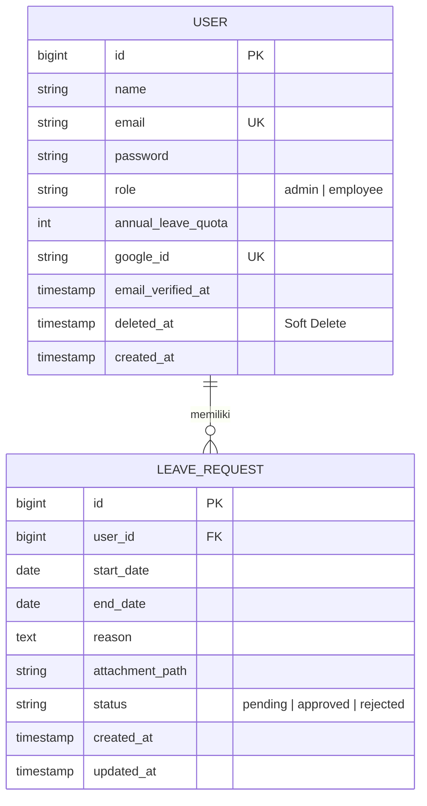

# 🚀 Employee Leave Management System (Technical Test)

Sistem manajemen cuti karyawan berbasis web yang dibangun dengan arsitektur *decoupled*. Proyek ini mendemonstrasikan integrasi *full-stack* modern, penggunaan OAuth, dan manajemen *business logic* yang kompleks.

### 🔗 API Documentation (Postman)

**[Buka Koleksi Postman & Environment](https://interstellar-crescent-117331.postman.co/workspace/Team-Workspace~6bd721b8-eb0a-4648-89e2-88735c2e982f/collection/20693765-a5bacfd7-d7db-4a73-90eb-755cbb972402?action=share&creator=20693765&active-environment=20693765-30dfd5f2-3594-4d8b-9162-ae68e02933d5)**


## 🏗️ Arsitektur & Justifikasi Teknologi

### Mengapa Laravel API + Next.js? (Bukan Laravel Blade)

Dalam proyek ini, saya memilih untuk memisahkan *frontend* dan *backend* daripada menggunakan Laravel Blade konvensional karena:

* **Reaktivitas UI/UX**: Next.js (React) memungkinkan pembuatan antarmuka yang sangat responsif (seperti navigasi tab tanpa reload dan pencarian *real-time*) yang memberikan pengalaman aplikasi *native*.
* **Separation of Concerns**: Backend murni berfungsi sebagai pengolah data (stateless), sehingga API ini siap digunakan jika di masa depan dikembangkan aplikasi mobile (Android/iOS).
* **Performa**: Dengan *Single Page Application* (SPA) behavior, beban server berkurang karena server hanya mengirimkan data JSON, bukan merender seluruh halaman HTML di setiap permintaan.

### Tech Stack Utama

* **Backend**: Laravel 11, **Laravel Socialite** (OAuth), Laravel Sanctum (Token Auth).
* **Frontend**: Next.js 14/15, Tailwind CSS, Lucide React (Icons).
* **Mailing**: Brevo (SMTP Relay).

---

---

## 📊 Struktur Database (ERD)

Berikut adalah hubungan antar entitas dalam sistem ini:



## 🛠️ Panduan Instalasi & Setup

### 1. Persiapan Backend (Laravel)

1. Masuk ke folder `backend`, jalankan `composer install`.
2. Setup `.env`:
```env
DB_DATABASE=leave_management

# Konfigurasi Socialite (Google OAuth)
GOOGLE_CLIENT_ID=your_id
GOOGLE_CLIENT_SECRET=your_secret
GOOGLE_REDIRECT_URL=http://localhost:8000/api/auth/google/callback

# Konfigurasi Brevo SMTP
MAIL_MAILER=smtp
MAIL_HOST=smtp-relay.brevo.com
MAIL_PORT=587
MAIL_USERNAME=your_brevo_username
MAIL_PASSWORD=your_brevo_api_key

```


3. Jalankan perintah krusial:
```bash
php artisan migrate --seed # Membuat user admin & 20 dummy employees
php artisan storage:link   # Penting untuk akses file lampiran
php artisan serve

```


### 2. Persiapan Frontend (Next.js)

1. Masuk ke folder `frontend`, jalankan `npm install`.
2. Setup `.env.local`:
```env
NEXT_PUBLIC_API_URL=http://localhost:8000/api
NEXT_PUBLIC_BASE_URL=http://localhost:8000

```


3. Jalankan aplikasi: `npm run dev`.

---

## 📝 Fitur Teknis Mendetail

### 1. Autentikasi Ganda (Socialite & Manual)

* **OAuth 2.0**: Menggunakan **Laravel Socialite** untuk integrasi Login Google. Hanya email yang sudah terdaftar oleh Admin yang dapat masuk ke dashboard (keamanan akses).
* **Password Pattern**: Karyawan baru yang didaftarkan Admin memiliki password otomatis dengan pola `{prefix_email}1234`.

### 2. Leave Management & Quota Logic

* **Perhitungan Akurat**: Menggunakan library Carbon (`diffInDays`) untuk menghitung durasi cuti secara tepat guna memotong kuota tahunan.
* **Atomic Updates**: Pengurangan kuota hanya terjadi saat Admin mengubah status menjadi `approved`.
* **File Attachment**: Implementasi pengiriman data menggunakan `Multipart/FormData` untuk mendukung unggah bukti dokumen (Max 2MB).

### 3. Manajemen User (Admin)

* **Soft Deletes & Restore**: Karyawan yang dihapus tidak benar-benar hilang dari database untuk menjaga integritas riwayat cuti, namun aksesnya dicabut. Admin dapat melakukan *Restore* kapan saja.
* **Brevo Mailing**: Otomatis mengirim email selamat datang beserta kredensial login setiap kali Admin mendaftarkan karyawan baru.

### 4. Frontend Optimization

* **Custom Hooks**: Logika API dipisahkan ke `src/hooks/` untuk menjaga komponen UI tetap bersih

 `useAdminManagement`: Mengelola pencarian karyawan, approval cuti, dan paginasi.
 `useEmployeeLeave`: Mengelola form pengajuan cuti dan validasi ukuran file di sisi klien.
* **Paginasi & Search**: Fitur pencarian *client-side* yang efisien dan paginasi data untuk performa optimal saat data karyawan bertambah banyak.


---

---

## 🛠️ Panduan Instalasi & Setup

### 1. Persiapan Backend (Laravel)

1. Masuk ke folder `backend`, jalankan `composer install`.
2. Setup `.env`:
```env
# Database
DB_DATABASE=leave_management

# OAuth (Laravel Socialite)
GOOGLE_CLIENT_ID=your_id
GOOGLE_CLIENT_SECRET=your_secret
GOOGLE_REDIRECT_URL=http://localhost:8000/api/auth/google/callback

# Mailing (Brevo SMTP)
MAIL_HOST=smtp-relay.brevo.com
MAIL_PORT=587
MAIL_USERNAME=your_brevo_username
MAIL_PASSWORD=your_brevo_api_key

```


3. Eksekusi perintah terminal:
```bash
php artisan migrate --seed # Membuat admin & 20 dummy employees
php artisan storage:link   # WAJIB untuk akses file lampiran
php artisan serve

```


### 2. Persiapan Frontend (Next.js)

1. Masuk ke folder `frontend`, jalankan `npm install`.
2. Setup `.env.local`:
```env
NEXT_PUBLIC_API_URL=http://localhost:8000/api
NEXT_PUBLIC_BASE_URL=http://localhost:8000

```


3. Jalankan aplikasi: `npm run dev`.

---


---

## 📂 Poin Penilaian Utama (Technical Highlights)

* **Clean Code**: Pemisahan logika bisnis dari UI menggunakan *Custom Hooks*.
* **Integrasi Pihak Ketiga**: Implementasi Google OAuth (Socialite) dan Brevo Mailing.
* **Integritas Data**: Penggunaan *Soft Deletes* untuk menjaga relasi database.
* **UX/UI**: Fitur pencarian *real-time*, paginasi data >10, dan feedback error 500/404 yang informatif.
## 📂 Struktur Folder (Penting)

* `backend/app/Http/Resources`: Transformasi data API (termasuk penanganan path lampiran).
* `backend/app/Services`: Logika bisnis (perhitungan kuota & upload file).
* `frontend/src/hooks`: Manajer *state* dan *side-effects* (API calls).
* `frontend/src/components`: UI modular yang dapat digunakan kembali.


